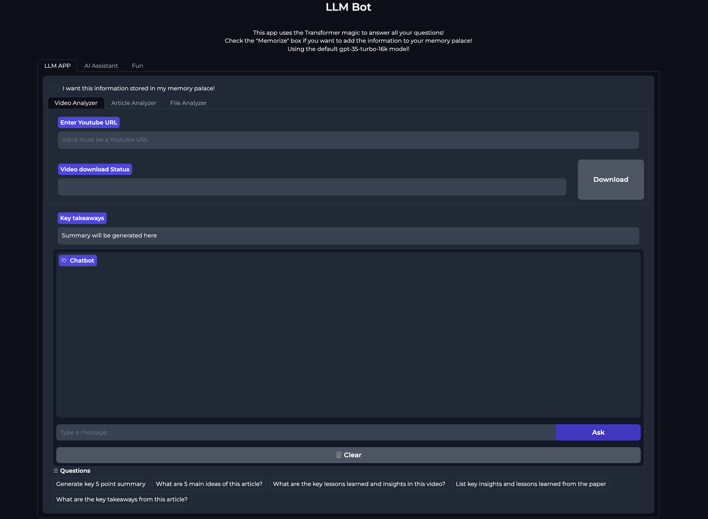
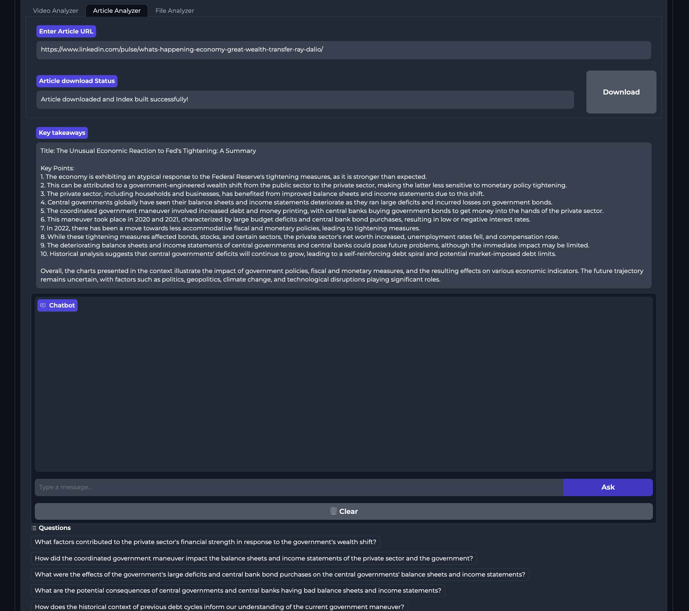
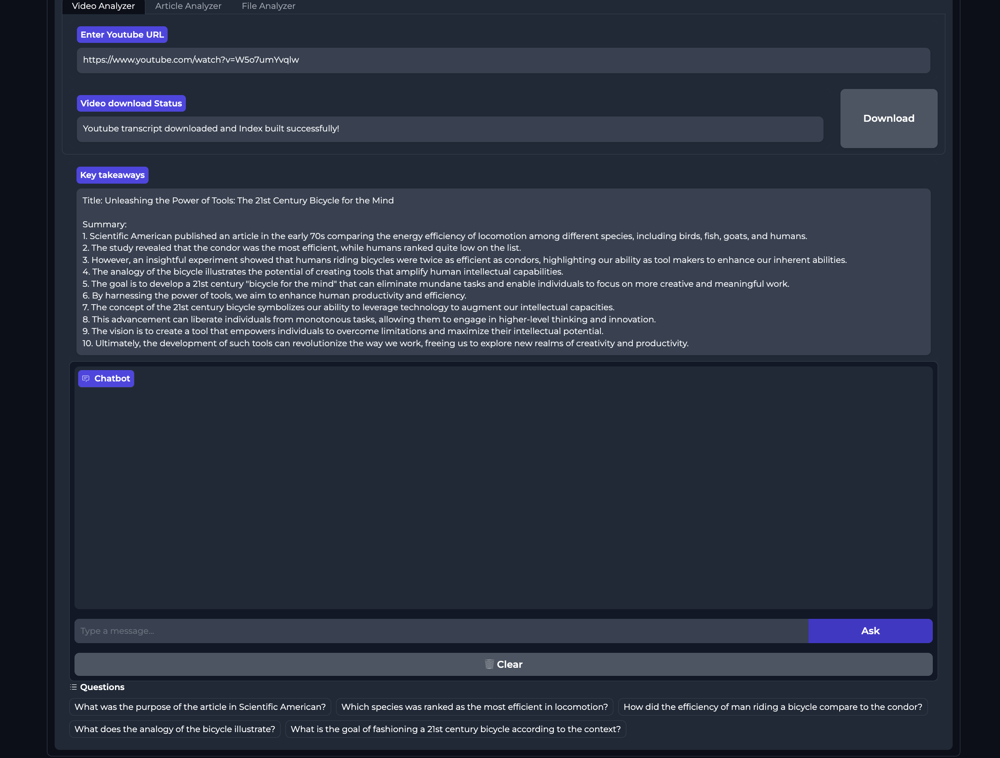
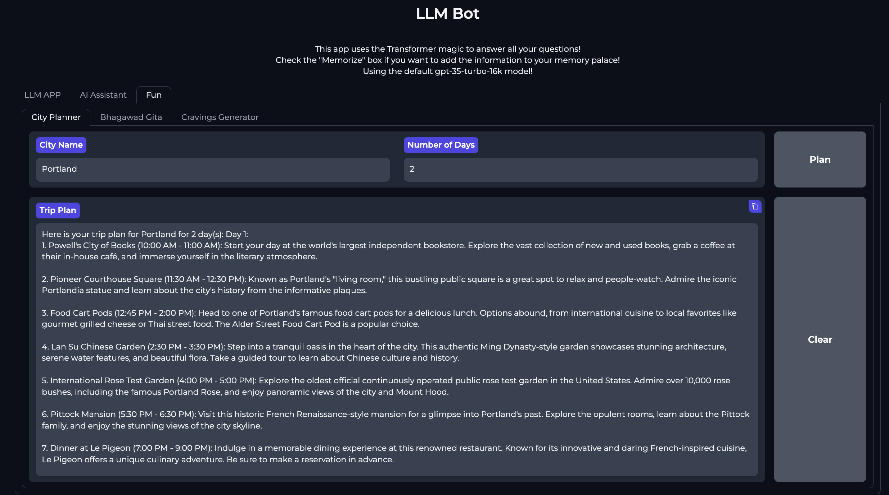

# LLM_QA_Bot

LLM_QA_Bot is a powerful and versatile bot that can answer questions related to various types of content. Whether you have uploaded files, articles, YouTube videos, audio files or even want to chat with AI models, LLM_QA_Bot has got you covered! 

There's also a memory palace feature now to help you remember the content you've analyzed with this app. "Memorize" checkbox feature has been added to let the user choose whether they want to save the content to their memory palace or not.

# Features

# Content Analysis
Upload your files or provide links to articles/YouTube videos, and let LLM_QA_Bot work its magic! It will analyze the content and provide you with detailed insights and information.



Example of Ray Dalio's LinkedIn article analysis:



Example of Steve Jobs's efficiency interview video analysis:



# Memory Palace
LLM_QA_Bot comes with a memory palace feature. You can choose to save the analyzed content to your memory palace for easy access and reference later. The app indexes the content and stores it in a Supabase database. You can then search for the content in your memory palace and access it whenever you want. 

Here is the app for the Memory Palace: https://github.com/dino1729/mymemorypalace

# Chat with LLMs
LLM_QA_Bot has integrated support for various AI models and services. You can chat with Azure OpenAI, perform Bing searches for the latest news updates, utilize Google palm, Cohere, and even run local AI models for local inferencing.


# Holy Book Chatbot
If you seek wisdom from the holy book, LLM_QA_Bot has you covered. It now includes a Pinecone database with Bhagavad Gita embeddings. You can access the database to get gyan (knowledge) from the holy book.


# Random Food Cravings Generator
Feeling hungry but can't decide what to eat? LLM_QA_Bot can help! It includes a random food cravings generator that suggests delicious food options to satisfy your cravings.


# Trip Planner
Planning a trip? LLM_QA_Bot is here to assist you. It now includes a trip planner feature that can help you plan your next adventure.



# Setup
To use LLM_QA_Bot, follow these steps:

Install all the required packages mentioned in the requirements.txt file.

Next, fill in the API keys and other details mentioned in the config/config.example.yml file and rename it to config.yml.

Finally, run the app using the following command:

```bash
python azure_gradioui.py
```

# Instruction set up Docker container:

```bash
docker build -t llmqabot .
docker run --restart always -p 7860:7860 --name llmqabot llmqabot
```
