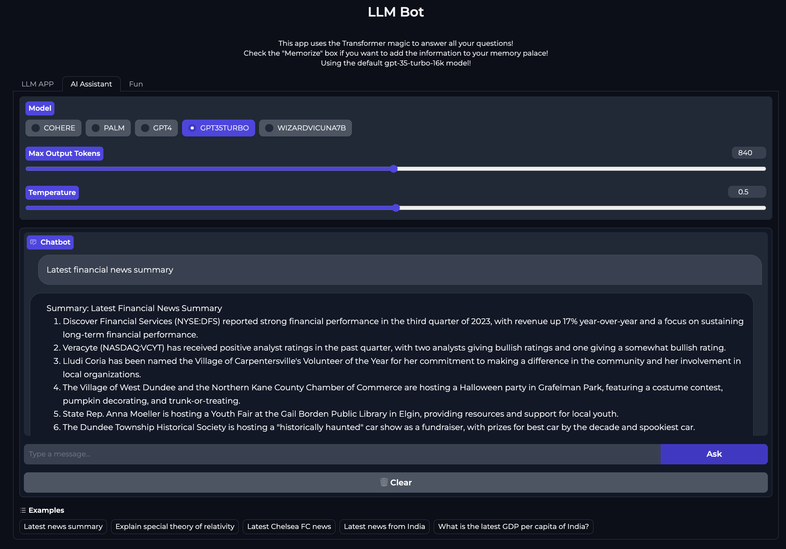

# LLM_QA_Bot

LLM_QA_Bot is a multi-modal research and productivity workspace built with Gradio, LlamaIndex, and a provider-agnostic LLM client. It ingests documents, articles, media links, and YouTube videos, writes summaries to local indexes, and layers on a toolbelt that spans a Memory Palace, multi-provider chat, Holy Book guidance, planning utilities, and image generation.


## Table of Contents
- [Overview](#overview)
- [Quickstart](#quickstart)
- [Feature Highlights](#feature-highlights)
- [Architecture](#architecture)
- [Project Layout](#project-layout)
- [Prerequisites](#prerequisites)
- [Setup](#setup)
- [Configuration Reference](#configuration-reference)
- [Configuration Tips & Secrets](#configuration-tips--secrets)
- [Running the App](#running-the-app)
- [Running Recipes](#running-recipes)
- [Typical Workflows](#typical-workflows)
- [Testing](#testing)
- [Troubleshooting](#troubleshooting)
- [Related Projects](#related-projects)
- [License](#license)

## Overview
LLM_QA_Bot centralizes knowledge ingestion and retrieval. Upload a document, paste a link, or point to a video; the bot extracts transcripts or text, chunkifies content through LlamaIndex, builds local vector/summary stores, and surfaces actionable answers through conversational agents. The Memory Palace feature can persist what you analyze into Supabase for long-term personal search, while the integrated chat tabs let you pivot between Azure OpenAI, Gemini, Cohere, Groq, LiteLLM, and local Ollama deployments. Additional planners and generators extend the workspace beyond Q&A.

## Quickstart
1. Create and activate a virtual environment: `python -m venv .venv && source .venv/bin/activate`.
2. Install dependencies: `pip install -r requirements.txt`.
3. Copy and edit config: `cp config/config.example.yml config/config.yml`, then add your provider keys (or use `config/.env` for secrets).
4. Launch the main Gradio UI: `python gradio_ui_full.py` (see [Running the App](#running-the-app) for Azure-focused or Docker options).
5. Run the test suite when changing code: `pytest tests -v` (fixtures mock external services, so tests run offline).

## Feature Highlights

### Content and Media Analysis
- Drag-and-drop PDFs, text files, DOCX, images, or audio, or paste article and YouTube URLs.
- Automatically downloads transcripts (or the full video when needed), summarizes the material, and generates example questions.
- Maintains local `vector_index` and `summary_index` folders so follow-up questions are answered instantly.


### Memory Palace
- Use the Memorize checkbox to push curated content into a Supabase-backed Memory Palace for long-term recall.
- Search the Memory Palace via semantic similarity (with Azure/OpenAI embeddings) and stream the response back into the UI.
- Companion Memory Palace app: https://github.com/dino1729/mymemorypalace

### Multi-provider Chat and Live Search
- Swap between Azure OpenAI, Gemini (migrated to modern `google-genai` SDK), Cohere, Groq (Llama/Mixtral), LiteLLM, or local Ollama tiers for chat completions.
- Trigger Firecrawl/Tavily-powered browsing to ground the conversation with fresh web data or Bing news headlines.

### Daily Reporter & Podcast Engine
- **Automated Briefings**: Generates daily Year Progress and News reports with motivational quotes and historical lessons.
- **Podcast Mode**: Transforms news updates into a natural, multi-turn dialogue between two AI personas (e.g., Rick and Morty) using a state-machine dialogue engine.
- **Persona Infusion**: Transcripts are dynamically rewritten to match the signature style, rhythm, and vocabulary of selected voices.
- **High-Fidelity audio**: Uses **Chatterbox TTS** for GPU-accelerated, zero-shot voice cloning from 10s reference samples.
- **Smart Caching**: Full transcript caching in JSON bundles ensures zero token cost for repeat audio generation or reviews.



### Everyday Agents
- Random Food Cravings generator suggests something new to eat.
- Trip Planner builds day-by-day itineraries for any city.
- Weather hooks (OpenWeather/PyOWM) keep plans realistic.
- Image Studio (OpenAI Image / NVIDIA NIM) supports prompt-to-image and edit workflows.


## Architecture
- **Interface**: Gradio apps in `misc_scripts/azure_gradioui.py` (Azure-focused) and `gradio_ui_full.py` (full provider switchboard).
- **Content processing**: `helper_functions/analyzers.py` orchestrates Whisper, yt-dlp, LlamaIndex, and the unified LLM client.
- **Vector storage**: Local folders (`UPLOAD_FOLDER`, `SUMMARY_FOLDER`, `VECTOR_FOLDER`) hold raw uploads and persisted indexes.
- **Memory Palace**: `helper_functions/query_supabasememory.py` streams Supabase RPC results via Azure embeddings.
- **LLM routing**: `helper_functions/llm_client.py` selects LiteLLM, Ollama, Gemini, Cohere, Groq, or native OpenAI clients.
- **Aux tools**: Trip planner, food planner, query agents, and image utilities live under `helper_functions/`.
- **Testing**: Over 150 pytest cases (see `tests/`) cover analyzers, chat generation, Firecrawl, planners, and Supabase flows.

## Project Layout
- `gradio_ui_full.py`: Main multi-provider Gradio UI entry point.
- `misc_scripts/azure_gradioui.py`: Azure-first Gradio variant with the same toolbelt.
- `helper_functions/`: Core analyzers, chat generators, planners, image helpers, and Memory Palace connectors.
- `config/`: Runtime settings (`config.yml`), prompt templates, and optional `.env` secrets.
- `frontend/`: Vite/React UI scaffold (run `npm install` then `npm run dev` for experiments).
- `tests/`: Comprehensive pytest suite with fixtures in `tests/conftest.py`; see `tests/README.md` for recipes.
- `screenshots/`: Screenshots and demo images showcasing the UI features.

## Prerequisites
- Python 3.10+ (virtual environments recommended).
- `ffmpeg` installed and on your PATH (required for moviepy/Whisper).
- Access tokens for the providers you plan to enable (OpenAI/Azure, Gemini, Cohere, Groq, LiteLLM proxy, Ollama, Tavily, Firecrawl, Supabase, OpenWeather, etc.).
- Optional: NVIDIA NIM credentials for the image studio tab, and a running Supabase project with the `mp_search` RPC if you intend to use the Memory Palace sync.

## Setup
1. Clone and enter the repository:
   ```bash
   git clone https://github.com/dino1729/LLM_QA_Bot.git
   cd LLM_QA_Bot
   ```
2. Create and activate a virtual environment:
   ```bash
   python -m venv .venv
   source .venv/bin/activate  # On Windows use .venv\\Scripts\\activate
   ```
3. Install dependencies (GPU-specific extras such as `whisper` or `supabase` are already listed):
   ```bash
   pip install -r requirements.txt
   ```
4. Copy the configuration template and provide real values:
   ```bash
   cp config/config.example.yml config/config.yml
   ```
5. (Optional) Add a `config/.env` file for secrets you do not want checked into version control.
6. Update `config/prompts.yml` if you want to customize summarization or question templates.
7. Ensure the directories referenced in `paths` exist or leave them blank to let the app create them automatically.

## Configuration Reference
All runtime settings live in `config/config.yml`. The most important sections are:

| Section | Keys (examples) | Purpose |
| --- | --- | --- |
| Gemini / Cohere / Groq | `google_api_key`, `cohere_api_key`, `groq_api_key`, `groq_model_name`, etc. | Enables alternative LLM backends. |
| LiteLLM / Ollama | `litellm_*`, `ollama_*` | Route chat, document Q&A, and embeddings through a gateway. |
| Chatterbox TTS | `chatterbox_tts_model_type`, `newsletter_progress_voice`, `newsletter_progress_voice_randomize`, `newsletter_news_voice` | GPU-accelerated on-device TTS with voice cloning and optional voice randomization. |
| Podcast Engine | `podcast_enabled`, `podcast_voice_a_*`, `podcast_voice_b_*`, `podcast_target_duration_seconds` | Configure dual-persona dialogue, including independent LLM/provider selection for each character. |
| Retriever / Firecrawl / Tavily | `retriever`, `firecrawl_server_url`, `tavily_api_key` | Power web research and ingestion. |
| Image generation | `nvidia_*`, `openai_image_model`, `openai_image_enhancement_model` | Configure the Image Studio tab. |
| Weather / Email | `openweather_api_key`, `pyowm_api_key`, `yahoo_id`, `yahoo_app_password` | Used by the planner and notification helpers. |
| Memory Palace | `supabase_service_role_key`, `public_supabase_url`, or `supabase_url`/`supabase_key` via `.env` | Required to push or query saved memories. |
| Paths | `UPLOAD_FOLDER`, `WEB_SEARCH_FOLDER`, `SUMMARY_FOLDER`, `VECTOR_FOLDER` | File system locations for temporary assets and indexes. |
| Settings | `temperature`, `max_tokens`, `model_name`, `context_window`, `default_chatbot_model`, etc. | LlamaIndex prompt/helper defaults. |

`config/prompts.yml` stores the templates for summary, example generation, and QA. Adjust these to enforce tone, length, or metadata policies. When using OpenAI for image operations, also set the `OPENAI_API_KEY` and optionally `OPENAI_API_BASE` environment variables so the SDK in `gptimage_tool` can authenticate.

## Configuration Tips & Secrets
- Minimal keys for local/offline runs: set `paths` plus one chat model (e.g., LiteLLM or Ollama). Skip Firecrawl/Tavily/Supabase keys if you do not need web or Memory Palace features.
- Web-connected research: add `tavily_api_key` or `firecrawl_server_url` and ensure `retriever` is set appropriately in `config.yml`.
- Memory Palace: supply `supabase_service_role_key` and `public_supabase_url`, and confirm the `mp_search` RPC exists in your Supabase project.
- Secrets storage: use `config/.env` or a local `.env` file and keep keys out of Git. Environment variables override `config.yml` where applicable.

## Running the App
### Local Gradio UI (Azure-focused layout)
```bash
python misc_scripts/azure_gradioui.py
```

### Local Gradio UI (Full provider switchboard)
```bash
python gradio_ui_full.py
```

### Frontend (React/Vite) dev server
```bash
cd frontend
npm install
npm run dev
```

### Docker
```bash
docker build -t llmqabot .
docker run --restart always -p 7860:7860 --name llmqabot llmqabot
```
Mount a volume for the `paths` directories if you want to persist indexes or uploads between container restarts.

## Running Recipes
- **Daily Reporter (Single Voice)**: `python year_progress_and_news_reporter_litellm.py --chatterbox-tts`
- **Daily Reporter (Podcast Mode)**: `python year_progress_and_news_reporter_litellm.py --chatterbox-tts --podcast`
- **Voice Randomization**: Set `newsletter_progress_voice_randomize: true` in `config.yml` to randomly select a different progress voice from `voices/` folder on each run. The CLI `--progress-voice` flag overrides both config and randomization.
- **Review Mode (No Audio)**: Add `--review` to see transcripts before synthesis.
- **Fast/Free Re-generation**: Add `--full-cache` to use cached transcripts from `daily_bundle_latest.json`.
- **One-shot full stack**: from repo root run `./start_fullstack.sh`. It creates/uses `.venv`, installs Python deps, builds the frontend, and launches `gradio_ui_full.py`.
- **Backend only (dev)**: `source .venv/bin/activate && python gradio_ui_full.py`. This starts FastAPI/Gradio on http://0.0.0.0:7860 with `/api/*` routes and serves a built `frontend/dist` if present.
- **Frontend dev server**: in another terminal `cd frontend && npm install && npm run dev`. Vite serves the UI on its own port; ensure the backend is running so API calls to `/api` succeed. Use a proxy if the backend lives on a different host/port.
- **Azure-focused UI**: `python misc_scripts/azure_gradioui.py` for the simplified Azure layout and endpoints.
- **Headless Docker**: `docker run --restart always -p 7860:7860 -v $(pwd)/data:/app/data llmqabot`. Add `--gpus all` if you plan to run Whisper locally.
- **Config check**: after editing `config/config.yml` or `.env`, restart the server so new keys are picked up. Keep secrets in `.env` (git-ignored) and refer to them from `config/config.yml` using environment variable expansion if needed.

## Typical Workflows
### Analyze a document, article, or video
1. Open the "Content Analysis" tab and upload files or paste a URL/YouTube link.
2. Choose whether to run in lite mode (transcript only) or allow full downloads.
3. Review the generated summary and suggested follow-up questions.
4. Ask additional questions against the freshly-built vector store without reprocessing the source.

### Grow and query the Memory Palace
1. Check the "Memorize" box before or after analysis to store the document in Supabase.
2. Use the Memory Palace tab to run semantic searches across everything you have saved.
3. Streamed responses show which memories were retrieved so you can cite or revisit them later.

### Chat, research, and plan
1. Switch to the Chat tab to pick Azure, Gemini, Cohere, Groq, LiteLLM, or Ollama models.
2. Enable Firecrawl/Tavily to blend real-time search with the LLM response for breaking news or research tasks.
3. Hop into the Trip Planner, Food Planner, or Weather tabs for specialized agents that share the same context window.

### Generate a Daily Podcast
1. Configure `podcast_voice_a` and `podcast_voice_b` in `config.yml`.
2. Run `python year_progress_and_news_reporter_litellm.py --chatterbox-tts --podcast`.
3. The engine generates a dialogue script where characters discuss the day's briefing, synthesizes it with voice cloning, and applies crossfading/normalization.

### Generate or edit images
1. Provide a prompt (or let the enhanced prompt helper rewrite it) in the Image Studio tab.
2. Use the Generate workflow for brand-new images or the Edit workflow with an uploaded file.
3. Configure output size and provider (OpenAI Images or NVIDIA NIM) based on the credentials you supplied.

## Testing
- Activate your virtual environment and run `pytest tests -v` for the full suite.
- See `tests/README.md` for focused commands, coverage reporting, and pytest tips (e.g., `pytest tests --cov=helper_functions --cov-report=term-missing`).
- Tests rely on the fixtures in `tests/conftest.py` to mock Supabase, OpenAI, Firecrawl, NVIDIA services, and temporary folders, so they are safe to run without hitting external APIs.

## Troubleshooting
- **ffmpeg not found**: install it via your package manager (`brew install ffmpeg`, `sudo apt install ffmpeg`, etc.) so Whisper/moviepy can handle audio extraction.
- **Embeddings or chat fail to load**: confirm the corresponding API keys are present in `config/config.yml` or `config/.env`, and restart the app after editing the file.
- **Vector index errors**: delete the folders configured in `paths` (or click the Clear button in the UI) to force a rebuild.
- **Supabase RPC complaints**: ensure the `mp_search` stored procedure exists in your Supabase project and that the service role key has permission to execute it.
- **Docker GPU/volume needs**: add `--gpus all` if you expect to run Whisper locally, and mount host folders so uploads and indexes are persisted.
- **Chatterbox TTS on CPU (WSL2)**: see [docs/TROUBLESHOOTING_CHATTERBOX_TTS_CPU.md](./docs/TROUBLESHOOTING_CHATTERBOX_TTS_CPU.md) for a comprehensive guide on setting up Chatterbox TTS for CPU inference, virtual environment best practices, and package installation order.

## Related Projects
- Memory Palace UI: https://github.com/dino1729/mymemorypalace
- Firecrawl Researcher samples: see `test_firecrawl_researcher.py` for mocked usage patterns.

## License
LLM_QA_Bot is released under the [MIT License](./LICENSE).


